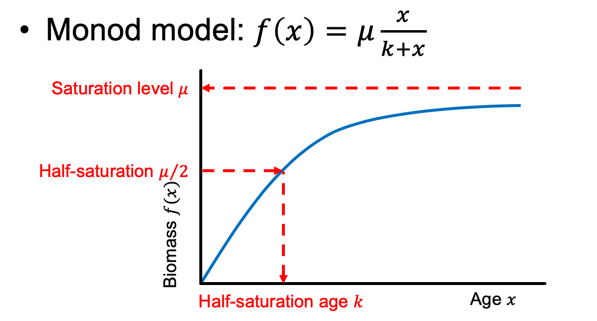
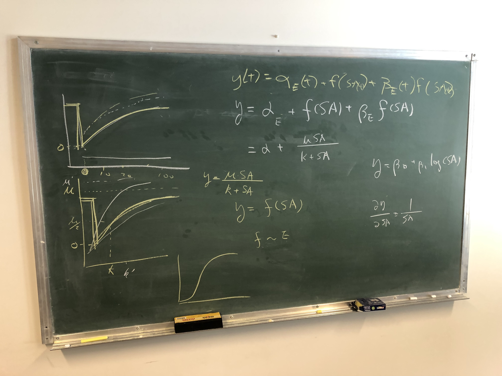
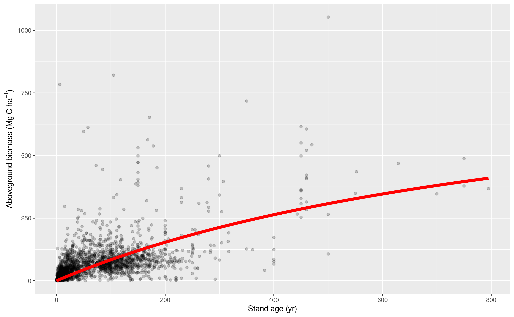

# Figure 1 design
Forest biomass-age growth curves

## Goals

To show additive vs. hierarchical methods to model biomass recovery with
stand age, with the impact from environmental change. Motivated by
Anderson-Teixeira et al. (2013) but don’t make it too similar. Show
innovation!

## Monod growth function

Panel a shows additive, and panel b shows hierarchical.

## Fit Monod model to ForC data

Fit a Monod model to all ForC simplified data, mu = 929.2607, k = 1008.9830.

## References

Anderson-Teixeira, K J, A D Miller, J E Mohan, T W Hudiburg, B D Duval,
and E H DeLucia. “Altered Dynamics of Forest Recovery under a Changing
Climate.” Global Change Biology 19, no. 7 (2013): 2001–2021.
<a href="https://doi.org/DOI" class="uri">https://doi.org/DOI</a>
10.1111/gcb.12194.
